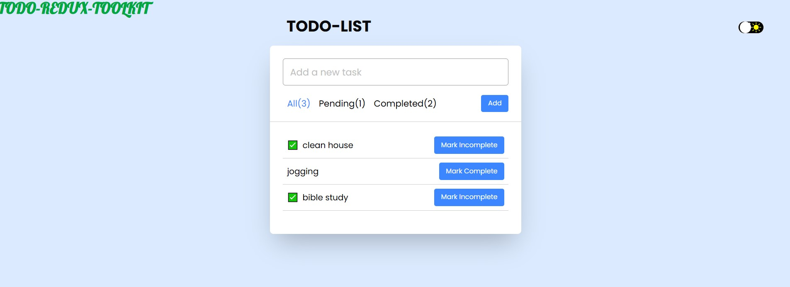

# Todo List App

## Description
This is a simple Todo List application built using **React**, **Redux**, **TanStack Router**, and **Tailwind CSS**. The app allows users to add tasks, mark them as completed or pending, and filter tasks based on their status.

## Features

- **Add Todo:** Users can add new tasks to the list.
- **Mark Complete/Incomplete:** Toggle the completion status of a task.
- **Filter Todos:** Users can filter tasks by *All*, *Pending*, and *Completed*.
- **Dark Mode Toggle:** Users can switch between light and dark mode.
- **Routing:** Uses **TanStack Router** for navigation.
## Preview


## Technologies Used

- React
- Redux (State Management)
- TanStack Router (Routing)
- Tailwind CSS (Styling)
- React Icons (For UI Icons)

## Installation

1. Clone the repository:

   ```sh
   git clone https://github.com/davisrya/todo-redux-toolkit.git
   ```

2. Navigate to the project directory:

   ```sh
   cd todo-list-app
   ```

3. Install dependencies:

   ```sh
   npm install
   ```

4. Start the development server:

   ```sh
   npm run dev
   ```

## Project Structure

```
/src
  ├── components/         # Reusable components
  ├── store/              # Redux store & slices
  ├── pages/              # Page components
  ├── App.jsx             # Main App component
  ├── index.css           # Global styles
  ├── main.jsx            # Entry point
```

## Usage

- Type a task in the input field and click the `Add` button to add it to the list.
- Click on `Mark Complete` or `Mark Incomplete` to toggle the task status.
- Use the navigation links to filter tasks by *All*, *Pending*, or *Completed*.
- Click on the dark mode toggle to switch themes.

## Contributing

Feel free to fork this repository and contribute by submitting a pull request.

## License

This project is open-source and available under the **MIT License**.

